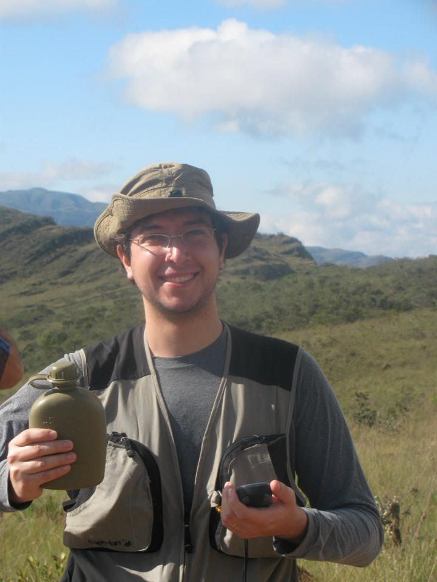

# 100 Days Of Code - Round 1 with Francisco Baptista

Hello world! Welcome to the explorer's journal of my 100 days expedition into the dreaded Codelands. This log will contain the records of my sucesses (hopefully a handful of these), failures (probably a lot of these) and all the hardwork and learning needed to make the previous a reality (definetly tons of these).

Full disclaimer: this is not my first journey into those shoalwaters, but my first time around, with all the confidence of the ignorant I came woefully unprepared. This time, having retreated to lick my wounds and prepare my campaign plan, I come - probably not ready - but more equipped to explore a bit fu 	rther than last time.
With the wonderful tools of community-building (and accompanying peer-pressure), forward-planning and commitment I plan to finish this round of coding at least one hour every day for 100 days.

Working full-time and studying at college make finding time to code a challenge in itself, but by setting clear goals and actionable milestones in-between I plan to boldly go where I've never been before.

**TL;DR: One man and one IDE enter, only one comes out! Welcome to the Codedome!** 

<b>Follow me on Twitter </b><a href="http://www.twitter.com/">here</a>.

<b>Check out my Github repos </b><a href="https://github.com/chicobaptista">here</a>.

## Projects I intend to complete on this round:

- [x] Personal Portfolio v1.0 (https://github.com/chicobaptista/chicobaptista.github.io)
- [ ] Basic Frontend development of the App Presta Conta
- [ ] GoogleDriveScripts to automate my translation workflow
- [ ] Personal porfolio v2.0
- [ ] A WebApp to help organize my board game collection

### Day 7: April 23, 2018

**Today's Progress**: Worked a bit more on the app frontend and created some alerts for the buttons

**Thoughts:** Learning more about Ionic and Angular.js, added some alerts() to the buttons with confirmation messages for the actions the user can take while on the app.

**Link(s) to work** 
1. Checkout the code for the app here: (https://github.com/chicobaptista/prestaConta)

### Days 5 and 6: April 21 and April 22, 2018

**Today's Progress**: Created a very basic app for our hackaton project and participated in the development both at the programming and business levels. Learnt a whole lot about front-end work, blockchains, smart contracts and also on delivering a presentation to a board of judges and developing the business side for a project, including creating and developing a business model. We didn't win, but it was very close!

**Thoughts:** The hackaton was a blast. The idea was that the other dev in the team was going to create the app for our project, and I was going to just create the mockups and start wireframing. However he got tangled into the blockchain side of the project and I started to create a very basic boilerplate, which gradually turned into me basically doing all the front-end development with his advice. Having this kind of responsability was actually really stressfull, but I learned a whole ton about Ionic, Angular.JS, UX and app development in 30 hours of non-stop work. The hackaton staff was really engaged with the whole deal, and we got a ton of advice from mentors on both the technical and the business sides of our project. Special shout-out to the Dev mentors who were immensily cool and helpful when I turned to them for advice on making the app. I'll be working on polishing the front-end this week before turning to a new project.

**Link(s) to work** 
1. Checkout the code for the app here: (https://github.com/chicobaptista/prestaConta)

### Day 4: April 20, 2018

**Today's Progress**: Not much dev work this time. Getting studying some EOS solidity for my first hackaton this weekend.

**Thoughts:** I'm going to a blockchain hackaton this weekend, and its the first time I'll be attending  such an event. I've talked with some devs about it and they all told me that it is absolutely not a problem to be on the first stages of learning how to program. And still I'm nervous about having little to offer the team when I get there. Well, there's a first for everything right? No use gettin this performance anxiety and not doing anything.

**Link(s) to work** 
1. No work today, but check out the hackaton I'm attending this weekend: (http://hackathoncieloblu.com.br/)

### Day 3: April 18, 2018

**Today's Progress**: Worked on a few batch scripts to automate some of the file handling in my translation job. Specifically, how to extract all images of office documents (.docx and .pptx) into a designated folder. Also, went into a dev career meetup.

**Thoughts:** Working on cmd scripts to automate some of the most boring parts of translation. That's one of the core purposes of programming right? To clear up time spent on mechanical tasks in favor of more productive and creative work. Also, lots of fun at the meetup, talked about getting your foot on the door of IT companies, transitioning from different fields, what junior, full and senior mean when tech changes so fast and other stuff. Networking is an important step on my coding journey as well, so I count it as time well spent.

**Link(s) to work** 
1. Simple scripts repository (https://github.com/chicobaptista/Translation-utilities)
2. Meetup event (https://www.meetup.com/pt-BR/dev-talks-campinas/events/249775999/)

### Day 2: April 17, 2018

**Today's Progress**: Did some final touches to my personal portfolio, including a photo of me, links to my work and a few typos fixed. Published it on github pages.

**Thoughts:** Still not really clear on how to merge a pull request when the branch to be pulled is very different from the head. Initial auto commits made a mess, and I found it easier to just copy files from the pullled branch on this case, since I was positivie it would work and was the final status intended.

**Link(s) to work** 
1. Multilingual support dev branch (https://chicobaptista.github.io)
2. Dev branch with all new features included (https://github.com/chicobaptista/chicobaptista.github.io/tree/Develop)

### Day 1: April 16, 2018

**Today's Progress**: Finished some css improvements and a multilingual jQuery support for my portfolio.

**Thoughts:** Using git to track feature development proved to be a brillient idea. On other news, asked StackOverflow about a jQuery issue that was bugging me for weeks and one of the first answers was 'did you use console.logging to try and figure out exactly where the issue is?' Of course I didn't and using the chrome developer tools (ctrl+shift+i) revealed that the jQuery link I was calling on my html was a slimified version, which didn't support the getJSON() method my script was using. So: (a) StackOverflow is full of helpful and amazing people and (b) use the damn console!

**Link(s) to work** 
1. Multilingual support dev branch (https://github.com/chicobaptista/chicobaptista.github.io/tree/feature-multilingual)
2. Basic CSS color palette and typefaces dev branch (https://github.com/chicobaptista/chicobaptista.github.io/tree/feature-ColorFonts)
3. Dev branch with all new features included (https://github.com/chicobaptista/chicobaptista.github.io/tree/Develop)

### Day 0: April 15, 2018

**Today's Progress**: Setup the Log and github repo.

**Thoughts:** Getting ready to start a new attempt @ the 100days of code challenge. The first time I tried this challenge I just posted every day my progress on Twitter, but quickly lost track of things specially when the inevitable off-days started accumulating. I was planning on building a proper log, when, perusing the 100 Days of Code Challenge official page I found out that there was a log template all along! Pro-tip: read the documentation for a new project before jumping in folks.

**Link(s) to work** 
No work this time, but if you're here, check out my [GitHubPage portolio (WIP)]:
1. (https://chicobaptista.github.io)